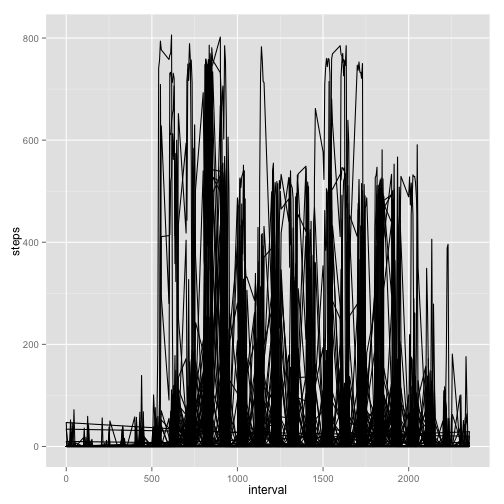
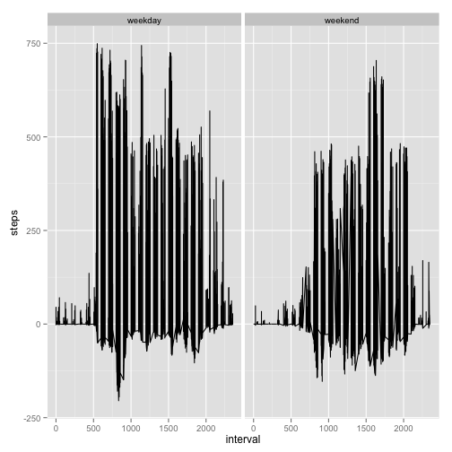

# Reproducible Research: Peer Assessment 1


## Loading and preprocessing the data

```r
if (!file.exists("activity.csv")) {
  unzip("activity.zip")
}
ds <- read.csv("activity.csv", header=TRUE, sep=",", stringsAsFactors=FALSE)
ds$date <- as.Date(ds$date)
ds$weekday <- weekdays(ds$date)
ds$hour_of_day <- as.integer(ds$interval/100)
summary(ds)
```

```
     steps            date               interval      weekday         
 Min.   :  0.0   Min.   :2012-10-01   Min.   :   0   Length:17568      
 1st Qu.:  0.0   1st Qu.:2012-10-16   1st Qu.: 589   Class :character  
 Median :  0.0   Median :2012-10-31   Median :1178   Mode  :character  
 Mean   : 37.4   Mean   :2012-10-31   Mean   :1178                     
 3rd Qu.: 12.0   3rd Qu.:2012-11-15   3rd Qu.:1766                     
 Max.   :806.0   Max.   :2012-11-30   Max.   :2355                     
 NA's   :2304                                                          
  hour_of_day   
 Min.   : 0.00  
 1st Qu.: 5.75  
 Median :11.50  
 Mean   :11.50  
 3rd Qu.:17.25  
 Max.   :23.00  
                
```

```r
str(ds)
```

```
'data.frame':	17568 obs. of  5 variables:
 $ steps      : int  NA NA NA NA NA NA NA NA NA NA ...
 $ date       : Date, format: "2012-10-01" "2012-10-01" ...
 $ interval   : int  0 5 10 15 20 25 30 35 40 45 ...
 $ weekday    : chr  "Monday" "Monday" "Monday" "Monday" ...
 $ hour_of_day: int  0 0 0 0 0 0 0 0 0 0 ...
```

## What is mean total number of steps taken per day?
1. Make a histogram of the total number of steps taken each day

```r
library(data.table)
#sum_daily_steps <- aggregate(steps ~ date, data=ds, sum)
dts <- na.omit(data.table(ds))
sum_daily_steps <- dts[, list(daily_steps=sum(steps, na.rm = TRUE)), by=list(date)]
hist(sum_daily_steps$daily_steps, xlab="steps per day", main="frequency of daily step")
```

 

```r
daily_steps_mean <- mean(sum_daily_steps$daily_steps)
daily_steps_median <- median(sum_daily_steps$daily_steps)
```
2. Report the mean and median total number of steps taken per day

> the mean total number of steps taken per day is 1.0766 &times; 10<sup>4</sup>

> the median total number of steps taken per day is 10765

## What is the average daily activity pattern?
1. Make a time series plot (i.e. type = "l") of the 5-minute interval (x-axis) and the average number of steps taken, averaged across all days (y-axis)

```r
library(ggplot2)
qplot(interval, steps, data=dts, geom="path")
```

 

2. Which 5-minute interval, on average across all the days in the dataset, contains the maximum number of steps?


```r
agg_steps_hour <- aggregate(steps ~ hour_of_day, data=ds, mean)
max_steps_hour <- agg_steps_hour[which.max(agg_steps_hour$steps),]
```

> The 8th hour has the highest activities

## Imputing missing values
1. Calculate and report the total number of missing values in the dataset (i.e. the total number of rows with NAs)

> Total rows with NA steps is 2304

2. Devise a strategy for filling in all of the missing values in the dataset. The strategy does not need to be sophisticated. For example, you could use the mean/median for that day, or the mean for that 5-minute interval, etc.
- Strategy: **Use rows with similar days of the week data to impute the missing ones**

```r
# use na functions, na.fail(DF) fails if there is NA, na.omit(DF) returns non-NA part of DF
# use median of the weekday + hour of day to impute missing steps

na_idx <- is.na(ds$steps)
median_weekday_hour <- aggregate(steps ~ weekday + hour_of_day, data=ds[!na_idx,], median)
```

3. Create a new dataset that is equal to the original dataset but with the missing data filled in.

```r
imp_dts <- data.table(ds) # create new data.table
imp_dts$steps <- as.numeric(imp_dts$steps) # 
imp_dts[na_idx,]$steps <- merge(imp_dts[na_idx,], median_weekday_hour, by=c("weekday","hour_of_day"))$steps.y
```

4. Make a histogram of the total number of steps taken each day and Calculate and report the mean and median total number of steps taken per day. Do these values differ from the estimates from the first part of the assignment? What is the impact of imputing missing data on the estimates of the total daily number of steps?


```r
imp_sum_daily_steps <- imp_dts[, list(daily_steps=sum(steps)), by=list(date)]
imp_daily_steps_mean <- mean(imp_sum_daily_steps$daily_steps)
imp_daily_steps_median <- median(imp_sum_daily_steps$daily_steps)
hist(imp_sum_daily_steps$daily_steps,  xlab="imputed steps per day", main="imputed frequency of daily step")
```

 

> the imputed mean total number of steps taken per day is 9524.8852

> the imputed median total number of steps taken per day is 1.0395 &times; 10<sup>4</sup>

After using imputed value, both mean and median drops, especially mean.  We have a lot more data for daily steps of 5000 or less, these were derived from imputed data.

## Are there differences in activity patterns between weekdays and weekends?
1. Create a new factor variable in the dataset with two levels – “weekday” and “weekend” indicating whether a given date is a weekday or weekend day.


```r
imp_dts$weekday_type <- ifelse(imp_dts$weekday %in% c("Sunday", "Saturday"), 'weekend', 'weekday')
```

2. Make a panel plot containing a time series plot (i.e. type = "l") of the 5-minute interval (x-axis) and the average number of steps taken, averaged across all weekday days or weekend days (y-axis). The plot should look something like the following, which was creating using simulated data:


```r
mean_wktype_interval <- imp_dts[, mean(steps), by=list(weekday_type, interval)]
m <- merge(imp_dts, mean_wktype_interval, by=c("weekday_type", "interval"))
m$diff <- m$steps - m$V1 
qplot(interval, diff, data=m, geom="path", facets=.~weekday_type, ylab="steps")
```

 

==================

Finally, run knitr2html() to correctly generate all the necessary output files.
library("knitr")
knit2html("PA1_template.Rmd")


